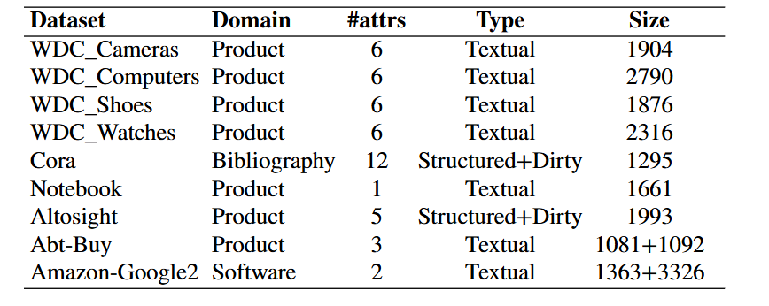

## UMDCL-Blocker

---

Paper: UMDCL-Blocker: Unsupervised Multi-Granularity Dynamic Fusion
with Contrastive Learning for Entity Blocking

The repository contains the implementation of all components of the UMDCL-Blocker framework, including model training, record embedding, and block generation.

### 1.Installation

The requirements.txt file contains the environment needed to run the code.

```python
pip install -r requirements.txt
```

### 2.Datasets

Public datasets used in the paper are from [DeepMatcher](https://github.com/anhaidgroup/deepmatcher/blob/master/Datasets.md), [WDC](http://webdatacommons.org/largescaleproductcorpus/v2/) and 
[2022 SIGMOD Programming Contest](http://sigmod2022contest.eastus.cloudapp.azure.com). The cora dataset is in the data folder.



### 3. How to use

#### Model Training

##### Dataset Construction

The dataset is provided in the `data` folder.(The complete data will be released later.)

Before training, ensure the dataset is converted to the corresponding format.

##### Training Example

Below is an example of training parameters:

```bash
python run.py \
--model_name_or_path "/home/cyp/uB-CL-main/uB-CL-main/sbert-all-mpnet-base-v2" \
--train_file "/home/cyp/uB-CL-main/uB-CL-main/data/data1/all_data_merge.csv" \
--max_seq_length 128 \
--grouped_size 10 \
--pool_type "cls" \
--loss_type "adaptive" \
--preprocessing_num_workers 4 \
--output_dir "./output" \
--num_train_epochs 5\
--per_device_train_batch_size 32 \
--learning_rate 5e-6 \
--logging_dir "./logs" \
--logging_steps 100 \
--save_steps 500 \
--eval_steps 500 \
--lambda_learning_rate 0.1 \
--do_train
```

For more details on parameters, refer to the `arguments.py` file.

---

#### Embedding Recording

The embedding recording files are located in the `get_embedding` folder, designed for SBERT. 

- **`double`**: Indicates a dual-source dataset.
- **`single`**: Indicates a single-source dataset.

To record embeddings, simply add the model path to the `embedding_model = []` list.

---

#### Block Generation

The block generation files are located in the `block_generation` folder. 

To generate blocks, add the embedding storage path to `DR_methods = []`.

---
